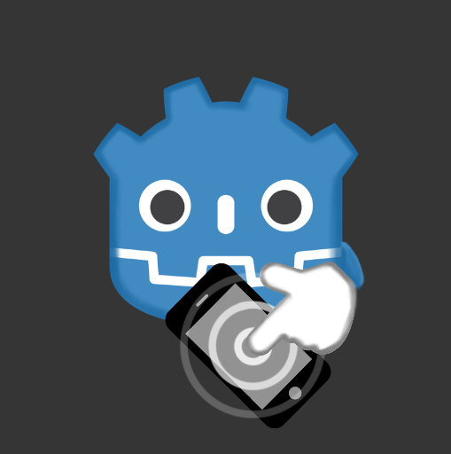

<h1 align="center">
  <br>
  
  <br>
  Godot Native Haptics
  <br>
</h1>

<h4 align="center">Godot plugin to use Haptics on Android/iOS. Support Godot 3 & 4</a>.</h4>

<p align="center">
  <a href="https://github.com/kyoz/godot-haptics/releases">
    
  </a>
  <span>&nbsp</span>
  <a href="https://github.com/kyoz/godot-haptics/actions">
    
  </a>
  <span>&nbsp</span>
  <a href="https://github.com/kyoz/godot-haptics/releases">
    
  </a>
  <span>&nbsp</span>
  
  <span>&nbsp</span>
  
</p>

<p align="center">
  <a href="#about">About</a> •
  <a href="#installation">Installation</a> •
  <a href="#usage">Usage</a> •
  <a href="#api">API</a> •
  <a href="#contribute">Contribute</a> •
  <a href="https://github.com/kyoz/godot-haptics/releases">Downloads</a> 
</p>

# About

This plugin help to use haptics on mobile app (Android/iOS). Because the default vibration options of Godot is a bit to strong on some old Android/iOS device since vibration duration does not work on them.

*Notes:* On iPhone, haptics only available on newer modals.

Was build using automation scripts combine with CI/CD to help faster the release progress and well as release hotfix which save some of our times.

Support Godot 3 & 4.

# Installation

## Android

Download the [android plugin](https://github.com/kyoz/godot-haptics/releases) (match your Godot version), extract them to `your_project/android/plugins`

Enable `Haptics` plugin in your android export preset

Enable `Vibrate` permission.

*Note*: You must [use gradle build](https://docs.godotengine.org/en/stable/tutorials/export/android_gradle_build.html) for Android to use plugins.

## iOS

Download the [ios plugin](https://github.com/kyoz/godot-haptics/releases) (match your Godot version), extract them to `ios/plugins`

Enable `Haptics` plugin in your ios export preset

# Usage

You will need to add an `autoload` script to use this plugin more easily.

Download [autoload file](./autoload) to your game (Choose correct Godot version). Add it to your project `autoload` list.

Then you can easily use it anywhere with:

```gdscript
Haptics.light()
Haptics.medium()
Haptics.heavy()

Why have to call `init()`. Well, if you don't want to call init, you can change `init()` to `_ready()` on the `autoload` file. But for my experience when using a lots of plugin, init all plugins on `_ready()` is not a good idea. So i let you choose whenever you init the plugin. When showing a loading scene...etc...

For more detail, see [examples](./example/)

# API

## Methods

```gdscript
void light() # A collision between small, light user interface elements
void medium() # A collision between moderately sized user interface elements	
void heavy() # A collision between large, heavy user interface elements
```

# Contribute

I want to help contribute to Godot community so i create these plugins. I've prepared almost everything to help the development and release progress faster and easier.

Only one command and you'll build, release this plugin. Read [DEVELOP.md](./DEVELOP.md) for more information.

If you found bug of the plugin, please open issues.

If you have time to fix bugs or improve the plugins. Please open PR, it's always welcome.

# License

MIT © [Kyoz](mailto:banminkyoz@gmail.com)
